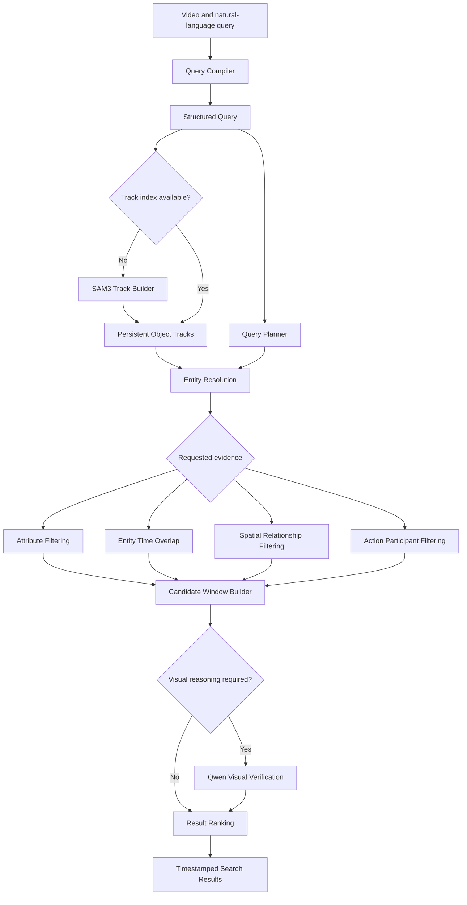

# Natural Language Video Search Engine

A local, single-video search engine that turns a natural-language request into
timestamped video results. The system combines structured query compilation,
SAM3 object tracking, deterministic spatial and temporal reasoning, and Qwen
visual verification.

Instead of treating a video as an undifferentiated collection of frames, the
engine builds persistent object tracks and searches over their identities,
attributes, positions, and time ranges. Expensive vision-language reasoning is
reserved for evidence that cannot be verified reliably from track metadata.

## Capabilities

- Search for visible entities using ordinary language.
- Resolve generic concepts against more-specific tracked objects.
- Verify attributes such as object color from labels or visual evidence.
- Find moments where multiple entities coexist.
- Evaluate spatial relationships such as `left_of`, `right_of`, `above`,
  `below`, `near`, and `overlapping`.
- Use chronological visual evidence to verify actions and complex scenes.
- Reuse persistent SAM3 tracks across later searches.
- Return ranked timestamp windows with the supporting object tracks.

## Workflow



The planner includes only the branches required by a query. A simple object
search can move directly from entity resolution to candidate construction,
while an attributed action or relationship query may use several filters and
visual verification stages.

## Components

### 1. Query Compiler

The query compiler uses an instruction-tuned Qwen language model to transform
free-form text into a validated structured query. The representation separates:

- **Entities** — visible people, animals, objects, or other physical concepts.
- **Attributes** — properties such as color or size.
- **Actions** — normalized verbs and their participants.
- **Relationships** — explicit subject-predicate-object relationships.
- **Temporal constraints** — ordering or duration requirements.

This separation lets later stages choose deterministic checks where possible
instead of asking a vision-language model to solve the entire query at once.

### 2. Track Index Preparation

Each required base entity is matched against the video's existing track
indexes. When no compatible index exists, SAM3 is prompted with the entity
concept, finds a seed frame, and propagates detected objects through the video.

Every resulting track records an object identity, its visible time range, and
its bounding box at each tracked frame. Tracks are persisted so future searches
for the same concept do not need to run SAM3 again.

### 3. Query Planner

The planner converts the structured query into an ordered dependency graph. It
selects only the operations needed for the request, including entity lookup,
attribute verification, co-occurrence, spatial reasoning, action filtering,
candidate construction, visual verification, and ranking.

### 4. Entity Resolution

Entity resolution maps requested concepts onto compatible track indexes. Exact
matches receive the strongest score, while a generic request can safely use a
more-specific index—for example, a `car` request may use `red car` and
`blue car` tracks.

A generic track is not treated as proof of a requested attribute. A `car`
track alone cannot confirm `blue car`; the color must be verified separately.

### 5. Attribute Filtering

Attributes are checked in two stages:

1. A cheap deterministic filter verifies or rejects attributes already encoded
   in a track label.
2. Unresolved attributes are checked visually using a contact sheet of crops
   from the same tracked object at several moments.

Unclear evidence remains unverified rather than being accepted as a match.

### 6. Entity Time Overlap

For queries involving multiple entities, track intervals are intersected to
find moments where all required participants are visible at the same time.
These overlapping intervals become the initial candidate windows for
relationship or action reasoning.

### 7. Spatial Relationship Filtering

Spatial relationships are evaluated from bounding-box geometry on frames where
both tracks are visible. A relationship must hold across a configurable share
of their common frames, which is more reliable than judging a single image.

Supported relationships are:

- `left_of` and `right_of`
- `above` and `below`
- `near`
- `overlapping`

### 8. Action Filtering

The deterministic action stage confirms that all declared participants are
present in a candidate window. It does not assume that co-occurrence proves an
action; the actual verb is deferred to chronological visual verification.

### 9. Candidate Window Builder

Matching tracks and relationship evidence are converted into timestamp
windows. Small amounts of context are added before and after each window, and
overlapping windows are merged before expensive verification.

### 10. Qwen Visual Verification

When a query requires visual or temporal semantics that track metadata cannot
prove, the engine samples frames from the candidate window in chronological
order and sends them to a Qwen vision-language model.

The verifier returns a strict match decision, confidence, factual reason, and
supporting frame numbers. Invalid or ambiguous responses fail closed.

### 11. Result Ranking

Verified candidate windows are ranked and returned with their start and end
timestamps, score, object labels, and supporting track identities.

## Core Models and Libraries

- **Qwen2.5 Instruct** for natural-language query compilation.
- **SAM3** for prompt-based object discovery, segmentation, and video tracking.
- **Qwen2.5-VL** for visual attribute, action, and scene verification.
- **PyTorch** and **Transformers** for model execution.
- **OpenCV** for video metadata, frame access, sampling, and object crops.

A CUDA-capable GPU is strongly recommended. CPU execution is possible for some
components but is significantly slower, and the complete model stack requires
substantial memory.

## Example

Given the query:

```text
a red car near a tree
```

the engine can:

1. Compile `car` and `tree` as entities, `red` as a car attribute, and `near`
   as a relationship.
2. Resolve or build the required SAM3 tracks.
3. Verify which car tracks are red.
4. Find time ranges where a verified car and a tree coexist.
5. Evaluate their distance over common tracked frames.
6. Build and optionally visually verify the matching timestamp windows.
7. Return the ranked moments and their supporting tracks.

## Current Status

The current workflow supports entity, attribute, co-occurrence, spatial, and
action-oriented searches. Explicit temporal-constraint planning—for queries
such as “before,” “after,” or ordered action sequences—is still under active
development. The engine currently searches one selected video at a time.
